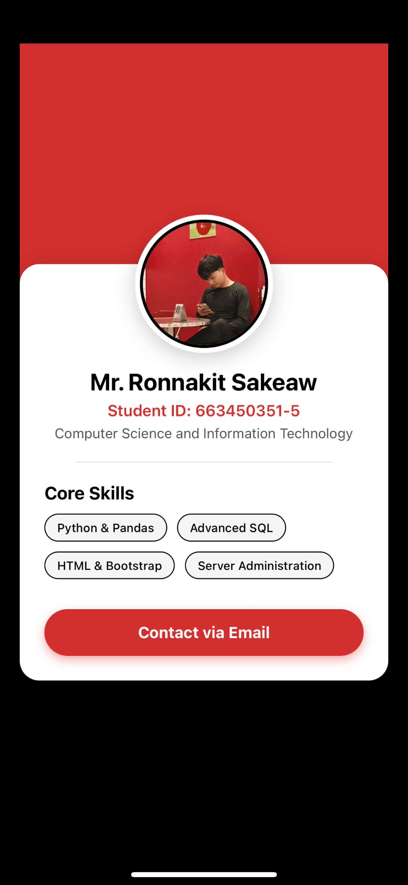
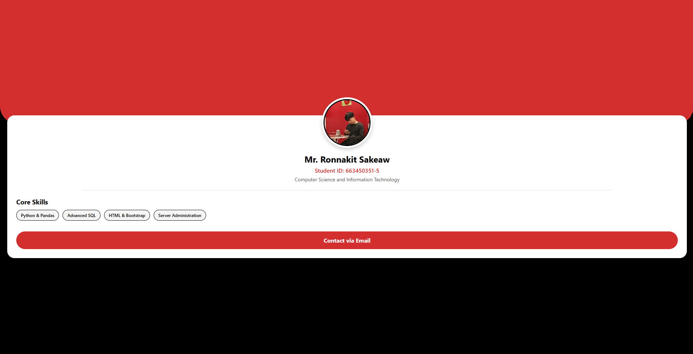

# 📱 Portfolio - Hybrid Mobile Application Program

Welcome to my personal portfolio application. This project was developed as an educational assignment for the **Hybrid Mobile Application Program** course. It demonstrates the fundamental concepts of building cross-platform applications using React Native and Expo.

## 👨‍🎓 Student Profile

* **Name:** Mr. Ronnakit Sakeaw
* **Student ID:** 663450351-5
* **Major:** Computer Science and Information Technology

## 🚀 Project Overview

This application is a single-page portfolio designed with a modern **White, Red, and Black** color scheme. The primary objective is to showcase responsive UI design that adapts seamlessly to different screen sizes, demonstrating the true "hybrid" nature of the framework.

### Key Features:
* Single-page architecture tailored for a personal portfolio.
* Responsive layout handling for both Mobile and Web/Desktop environments.
* Clean and professional UI using standard React Native components.

## 📸 Screenshots

Here is how the application looks on different platforms:

### Mobile View (iOS / Android)

### Desktop / Web View

## 🛠️ Technology Stack

* **Framework:** React Native
* **Toolchain:** Expo (Version 54)
* **Language:** TypeScript / JavaScript

## 📚 Educational Purpose

*Disclaimer: This repository is created exclusively for educational purposes as part of the university curriculum. It is intended to demonstrate practical skills in hybrid mobile application development.*